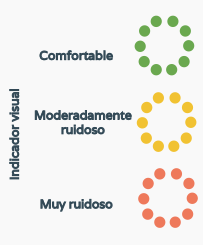

# CONCIENCIA SONORA

Un proyecto que busca **visibilizar la exposición cotidiana al ruido**, orientado a acompañar y promover campañas de concientización acerca de la contaminación sonora. Desarrollamos un **producto tecnológico, versátil y de bajo costo**. El mismo realiza el **monitoreo y la señalización visual** del nivel de ruido al que se está expuesto en un determinado espacio. Se utilizan descriptores derivados de los criterios [NCB](https://asa.scitation.org/doi/10.1121/1.398243) y [SIL](https://asa.scitation.org/doi/10.1121/1.381757), ademas de evaluar el nivel de presión acústica por bandas de octava.

La señalización indica, a través de un patrón de colores, el grado de confort acústico en el espacio donde se encuentra.

## Información técnica
El núcleo de este dispositivo gira en torno a la plataforma **Raspberry Pi**, mientras que la captura de señales se hace a través de un micrófono conectado a un circuito amplificador de bajo ruido de diseño propio.

El desarrollo del hardware se realizó con la ayuda de herramientas como **KiCAD** (para diseño electrónico) y **FreeCAD** (para diseño de carcasa y piezas accesorias). El software se desarrolló sobre un sistema **Linux embebido** con lenguaje **Python**.

Algunas de sus características son:

* Autónomo y recargable con cualquier fuente / cargador de celular (5V - 2A).
* Botón encendido/apagado del sistema.
* Botón de modo nocturno.
* Accesible desde la red local, incluye interfaz con datos de medición.

## Template 

https://inovatik.com/revo-landing-page/index.html
https://demo.goodlayers.com/apzo/product/
https://wp.nyu.edu/sonyc/
https://www.zooniverse.org/projects/anaelisa24/sounds-of-new-york-city-sonyc/about/research
## Herramientas
https://cssgradient.io/
https://pixlr.com/es/x/
