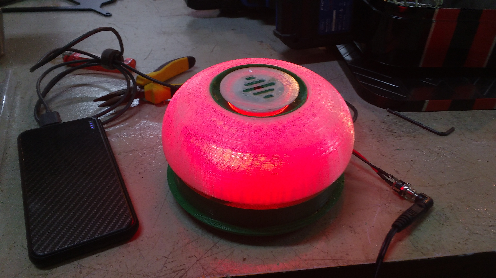

Conciencia Sonora es un proyecto que busca visibilizar la exposición cotidiana al ruido, orientado a acompañar y promover campañas de concientización acerca de la contaminación sonora. Desarrollamos un producto tecnológico, versátil y de bajo costo. El mismo realiza el monitoreo y la señalización visual del nivel de ruido al que se está expuesto en un determinado espacio.

La señalización indica, a través de un patrón de colores, el grado de confort acústico en el espacio donde se encuentra.

## Información técnica
El núcleo de este dispositivo gira en torno a la plataforma Raspberry Pi, mientras que la captura de señales se hace a través de un micrófono conectado a un circuito amplificador de bajo ruido de diseño propio.

* Autónomo y recargable con cualquier fuente / cargador de celular (5V - 2A).
* Botón encendido/apagado del sistema
* Botón de modo nocturno
* Accesible desde la red local, incluye interfaz con datos de medición

