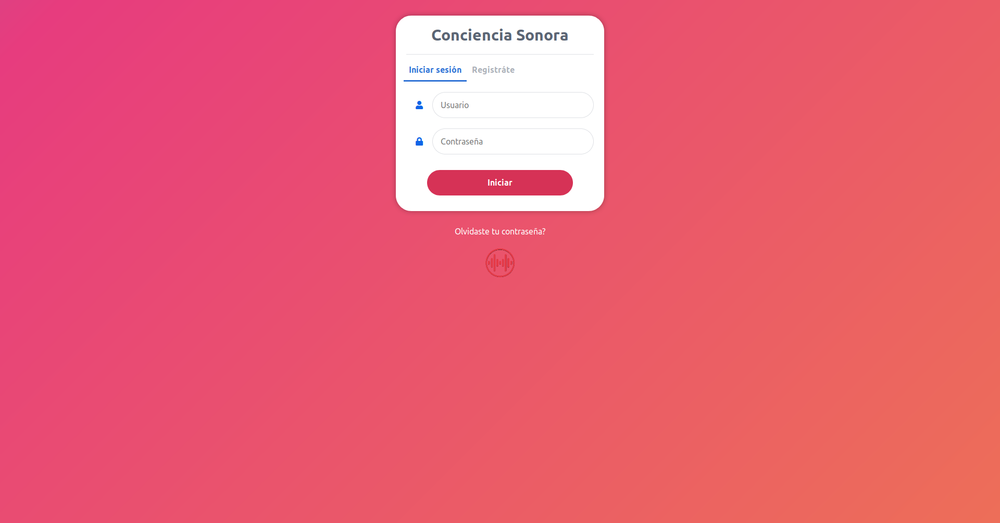

# CONCIENCIA SONORA - WEBAPP



## Caracteristicas

* **Diseño -** Diseño basado en [HTML5](https://developer.mozilla.org/es/docs/HTML/HTML5), [CSS3](https://developer.mozilla.org/es/docs/Web/CSS) y [Bootstrap4](https://getbootstrap.com/). Se usa [Flask](http://flask.palletsprojects.com/en/1.1.x/) y [Jinja2](https://jinja.palletsprojects.com/en/2.10.x/) para crear los templates.
* **Administración de sesiones -** La validacion de datos enviados al servidor (usuario, contraseña y email) es mediante [Python](https://www.python.org/). Se almacenan todos los datos de las sesiones en una base de datos relacional.
* **MySQL Queries -** *Select*, *Insert* almacenados desde/hacia las tablas de la base de datos.
* **Rutas -** Se asignan funciones a las rutas de la webApp, utilizando Flask.

## Instalación y uso

### Requerimientos

1. Python (> v3.x). Se recomienda instalar [Miniconda](https://docs.conda.io/en/latest/miniconda.html)
2. [XAMPP](https://www.apachefriends.org/es/index.html).

### Descargar repositorio

**Con `git`**
Si tiene instalado git, la forma más fácil de acceder a estos archivos es clonar el repositorio en el directorio que elija.

``` bash
git clone https://github.com/infiniemlabs-acustica/conciencia-sonora.git
```

**Sin `git`**
Alternativamente, puede descargar todo el repositorio como un archivo .zip desde la página de inicio del repositorio utilizando el botón verde "Clonar o descargar" en la esquina superior derecha.

### Entorno virtual

``` bash
conda create --app # creando un entorno 
conda activate app # activar el entorno
``` 

### Instalar paquetes

Instalar los paquetes definidos en el archivo requirements.txt, en el entorno *app*

``` bash
pip install -r requirements.txt
``` 
### Preparar XAMPP

* Lanzar XAMM (Apache y MySQL)

#### En linux

``` bash
sudo /opt/lampp/lampp startapache
sudo /opt/lampp/lampp startmysql
``` 
o todos en una sola instrucción

``` bash
sudo /opt/lampp/lampp start
```

### Crear base de datos 

En el browser

``` browser
http://localhost/phpmyadmin/
```

En la consola de SQL ejecutar:

``` sql
CREATE DATABASE IF NOT EXISTS `conciencia_sonora` DEFAULT CHARACTER SET utf8 COLLATE utf8_general_ci;

USE `conciencia_sonora`;

CREATE TABLE IF NOT EXISTS `cuentas` (
	`id` int(11) NOT NULL AUTO_INCREMENT,
  	`username` varchar(50) NOT NULL,
  	`password` varchar(255) NOT NULL,
  	`email` varchar(100) NOT NULL,
    PRIMARY KEY (`id`)
) ENGINE=InnoDB AUTO_INCREMENT=2 DEFAULT CHARSET=utf8;

INSERT INTO `cuentas` (`id`, `username`, `password`, `email`) VALUES (1, 'test', 'test', 'test@test.com');
``` 

### Lanzar Server Flask app

``` bash
conda activate app 
python main.py
``` 
En el browser local al servidor:

``` browser
http://localhost:5000/concienciasonora/login/
```
Desde otro browser:

``` browser
http://<ip asignado al servidor>:5000/concienciasonora/login/
```

## Referencias

El desarrollo fue inspirado en el tutorial de [David Adams](https://codeshack.io/author/david-adams/) de [CodeShack](https://codeshack.io/author/david-adams/), *[Login System with Python Flask and MySQL](https://codeshack.io/login-system-python-flask-mysql/)*.

